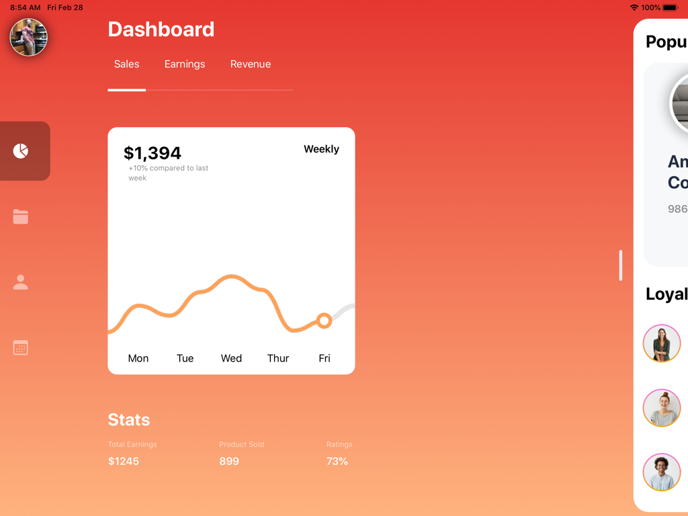
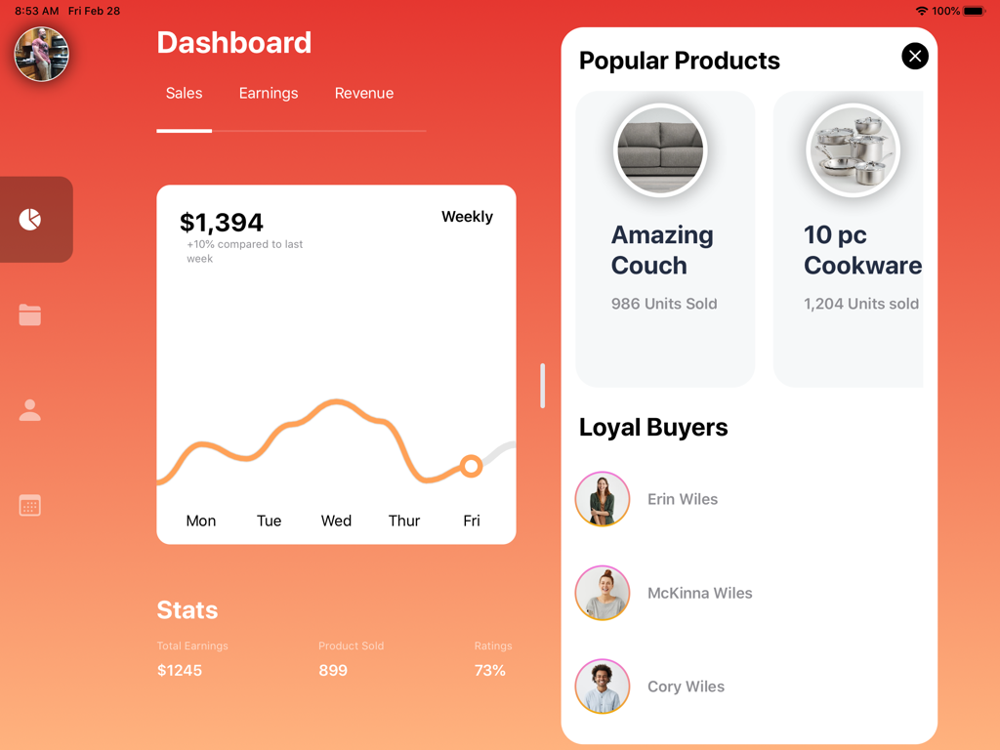

# DashboardUI

## Inspiration

* [https://dribbble.com/shots/6807868-Commerce-Dashboard-UI](https://dribbble.com/shots/6807868-Commerce-Dashboard-UI) by [Ghani Pradita](https://dribbble.com/ghanipradita)

## Post

[Fun Times Creating a Dashboard with SwiftUI](https://medium.com/@kwylez/fun-times-creating-a-dashboard-with-swiftui-28b68f1ffb89)

### Animations and Interactions

You can drag the detail screen to open, the chart path and circle come together from opposites axis and the filter menu "underline" will move to the origin and size of the selected
menu item.

